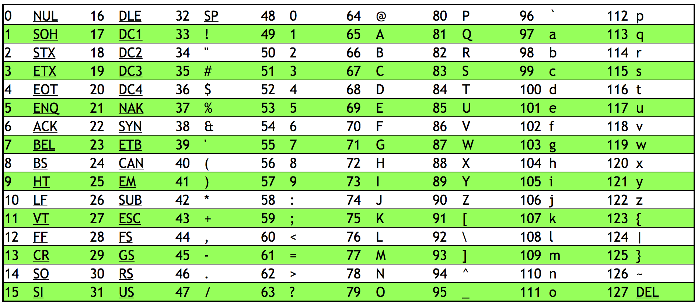

# Hardware

Como os hardwares interpretam e processam a informação? Como um código se comunica com a máquina e retorna resultados.

**Como compreender a lógica do sistema binário?**

O primeiro passo seria compreender o conceito de representação numérica. O sistema numérico utilizado no dia a dia trabalha com a base 10, por exemplo, o número 254 pode ser definido, aritmeticamente, da seguinte maneira:

| Centena | Dezena | Unidade |
| ------- | ------ | ------- |
| 100 x 2 | 10 x 5 |  1 x 4  |

Portanto, a soma de (100 x 2) + (10 x 5) + (1 x 4) é equivalente ao número 254. A mesma lógica se aplica, por exemplo, em numerais maiores, tais como 2907

| Milhar   | Centena | Dezena | Unidade |
| -------- | ------- | ------ | ------- |
| 1000 X 2 | 100 x 9 | 10 x 0 |  1 x 7  |

**Os computadores, no entanto, não trabalham com base 10, mas com base 2.**

Isso significa que, ao contrário de utilizar a lógica de posição baseada em 10^0 = 1 (unidade), 10^1 (dezena) = 10, 10^2 = 100 (centena) ou 10^3 = 1000 (milhar), os computadores utilizam a lógica numérica 2^0 = 1, 2^1 = 2, 2^2 = 4, 2^3 = 8.

**Mas por que?** Basicamente os circuitos eletrônicos trabalham com dois estados (ligado e desligado) ou, 0 e 1. Trabalhar com dois estados de tensão elétrica permite identificar o sinal com pouca ou quase nenhuma interferência/ruído, garantindo desta forma maior confiabilidade do circuito eletrônico.

Sinais com variações elétricas em posições intermediárias, além de 0 e 1, poderiam criar possíveis pontos de falhas e dificuldades de leitura por causa de ruídos externos.

As portas lógicas só precisam de dois estados para realizarem as operações booleanas:

- **AND:** a saída é 1 apenas se as duas entradas forem iguais a 1;
- **OR:** a saída é 1 se uma das duas entradas forem 1;
- **NOT:** inverte o bit (se a entrada for 1, a saída é 0, e vice-versa).

Como representamos os números em binário?

| 4 (2^2) | 2 (2^1) | 1 (2^0) | Lógica de cálculo / Valor                   |
| ------- | ------- | ------- | ------------------------------------------- |
| 0       | 0       | 0       | (4 x 0) + (2 x 0) + (1 x 0) = 0 + 0 + 0 = 0 |
| 0       | 0       | 1       | (4 x 0) + (2 x 0) + (1 x 1) = 0 + 0 + 1 = 1 |
| 0       | 1       | 0       | (4 x 0) + (2 x 1) + (1 x 0) = 0 + 2 + 0 = 2 |
| 0       | 1       | 1       | (4 x 0) + (2 x 1) + (1 x 1) = 0 + 2 + 1 = 3 |
| 1       | 0       | 0       | (4 x 1) + (2 x 0) + (1 x 0) = 4 + 0 + 0 = 4 |
| 1       | 0       | 1       | (4 x 1) + (2 x 0) + (1 x 1) = 4 + 0 + 1 = 5 |
| 1       | 1       | 0       | (4 x 1) + (2 x 1) + (1 x 0) = 4 + 2 + 0 = 6 |
| 1       | 1       | 1       | (4 x 1) + (2 x 1) + (1 x 1) = 4 + 2 + 1 = 7 |

Para representar valores acima de 7 (entre 8 e 15), precisamos adicionar um quarto bit*. Esse novo bit ocupa a posição de índice 3, cujo valor posicional é 2^3.

- **Posição:**  posição física do dígito. No número 1000 (8 em binário), o dígito 1 está na posição de índice 3.
- **Valor posicional:** valor dado por 2^n para aquela posição. **Exemplo:** Para a posição 2 (2^2) o valor é 4, para posição 3 (2^3) o valor é 8, para a posição 4 (2^4) o valor é 16, e assim sucessivamente.

| 8 (2^3) | 4 (2^2) | 2 (2^1) | 1 (2^0) | Lógica de cálculo / Valor                                 |
|-------- | ------- | ------- | ------- | --------------------------------------------------------- |
| 1       | 0       | 0       | 0       | (8 X 1) + (4 x 0) + (2 x 0) + (1 x 0) = 8 + 0 + 0 + 0 = 8 |

**Como representar alfabeto utilizando o sistema binário?**

Existem algumas maneiras de se utilizar padrões de correspondência para representar letras e outros valores utilizando somente código binário, por exemplo o ASCII (Americam Standard Code for Information Interchange).

A ASCII original é limitado à 7 bits, o que corresponde a um total de 128 caracteres, já o ASCII estendido é de 8 bits, resultando em 256 caracteres totais. O computador armazena o padrão de bits expressos em zeros e uns e o programa interpreta esses valores para exibir as palavras, símbolos ou pontuações.

Por exemplo, nos dois blocos de um byte (conjunto de 8 bits) cada temos representados em binário os números 79 e 73:

| 128 | 64 | 32 | 16 | 8 | 4 | 2 | 1 |   | 128 | 64 | 32 | 16 | 8 | 4 | 2 | 1 |
| --- | -- | -- | -- | - | - | - | - | - | --- | -- | -- | -- | - | - | - | - |
|  0  | 1  | 0  | 1  | 0 | 0 | 0 | 1 |   |  0  | 1  | 0  | 1  | 0 | 0 | 1 | 1 |

Em ASCII seria os caracteres O e I: OI.

*PONTO PARA LEMBRAR: um bit equivale à quantidade de dígitos binários. Por exemplo:

| Número binário | Bits   |
| -------------- | ------ |
| 0              | 1 bit  |
| 10             | 2 bits |
| 0100           | 4 bits |
| 100            | 3 bits |

Embora 0100 e 100 correspondam ao mesmo número binário, ambos possuem quantidades diferentes de bits. Zeros à esquerda são opcionais na representação de um número binário, assim como é opcional escrever 07 para representar o número 7, porém, caso decida utilizar, eles contam como bits e, portanto, ocupam espaço na memória.
